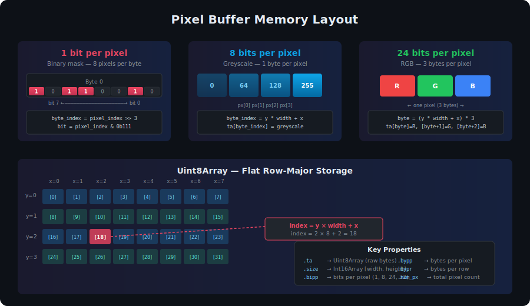

# Chapter 1: Introduction & Overview

## What Is jsgui3-gfx-core?

**jsgui3-gfx-core** is a pure-JavaScript pixel buffer library. It provides data structures and algorithms for creating, manipulating, and processing raster images represented as typed arrays. There are no Canvas, DOM, or browser dependencies — it runs identically in Node.js and in browsers.

The library is the graphical core of the **jsgui3** ecosystem, but it is fully usable as a standalone module for any application that needs low-level pixel manipulation.

## Core Concept: The Pixel Buffer

At the heart of the library is the **Pixel Buffer** — a flat `Uint8Array` that stores pixel data in a configurable bits-per-pixel format:

| Format | `bits_per_pixel` | Bytes per Pixel | Use Case |
|--------|-----------------|-----------------|----------------------------------------|
| 1bipp  | 1               | 0.125           | Binary masks, thresholds, monochrome   |
| 8bipp  | 8               | 1               | Greyscale images, single-channel data  |
| 24bipp | 24              | 3               | RGB color images                       |
| 32bipp | 32              | 4               | RGBA images with alpha transparency    |

Every pixel buffer is defined by its **size** (width × height) and its **bits_per_pixel**. The underlying typed array is sized exactly to hold `width × height × bytes_per_pixel` bytes (with bit-packing for 1bipp).



## What This Library Provides

### Pixel Manipulation
Get and set individual pixels at any bit depth. Direct byte-index access for performance-critical inner loops.

### Drawing Primitives
Rasterize lines, rectangles, and filled polygons directly onto pixel buffer memory. All drawing operates on the typed array — no rendering pipeline required.

### Convolution & Image Processing
Apply convolution kernels (edge detection, Gaussian blur, Sobel filters, Laplacian of Gaussian) to pixel buffers. Create new processed buffers from existing ones.

### Color Format Conversion
Convert between bit depths: 1bipp ↔ 8bipp ↔ 24bipp ↔ 32bipp. Threshold greyscale to binary. Add alpha channels.

### Resize, Crop, Clone
Create resized copies of pixel buffers using area-weighted sampling. Crop and uncrop. Clone buffers or create blank copies with matching dimensions.

### Typed Array Mathematics
A comprehensive `ta_math` subsystem provides low-level operations on typed arrays: bitwise manipulation, rect copying, polygon stroke calculation, bounds overlap detection, and pixel reading/writing.

### Shapes & Geometry
Rectangle and Polygon classes for geometric operations and scanline-based polygon rasterization.

### Pixel Position Lists
Efficient storage and iteration of sparse pixel coordinate sets using packed `Uint16Array` storage.

## Where It Fits in the jsgui3 Ecosystem

```
┌─────────────────────────────────────────────┐
│              jsgui3-html                    │
│         (DOM Controls, UI Layer)            │
├─────────────────────────────────────────────┤
│            jsgui3-gfx-core                  │  ← This library
│     (Pixel Buffers, Drawing, Convolution)   │
├─────────────────────────────────────────────┤
│   lang-mini        obext          fnl       │
│  (Utilities)   (Obj Extension) (Functional) │
└─────────────────────────────────────────────┘
```

The library can be used by `jsgui3-html` for canvas rendering, collision detection, and image analysis, but it has **no dependency** on jsgui3-html. It depends only on three small utility libraries:

- **`lang-mini`** — Type checking, iteration, and general language utilities
- **`obext`** — Object extension helpers (`ro` for read-only properties, `prop` for property definitions)
- **`fnl`** — Functional programming utilities (dev dependency via `fnlfs` for file I/O in examples)

## Quick Example

```js
const gfx_core = require('jsgui3-gfx-core');
const { Pixel_Buffer, Pixel_Buffer_Painter } = gfx_core;

// Create a 256×256 RGB pixel buffer
const pb = new Pixel_Buffer({
    bits_per_pixel: 24,
    size: [256, 256]
});

// Fill the whole buffer with dark blue
pb.color_whole([20, 30, 80]);

// Draw a red rectangle using the painter
const painter = new Pixel_Buffer_Painter({ pb });
painter.rect([50, 50], [100, 60], [255, 40, 40]);

// Access raw pixel data
console.log(pb.ta);        // Uint8Array(196608)
console.log(pb.bipp);      // 24
console.log(pb.size);       // Int16Array [256, 256]
```

---

**Next:** [Chapter 2: Installation & Getting Started →](./02-installation.md)
