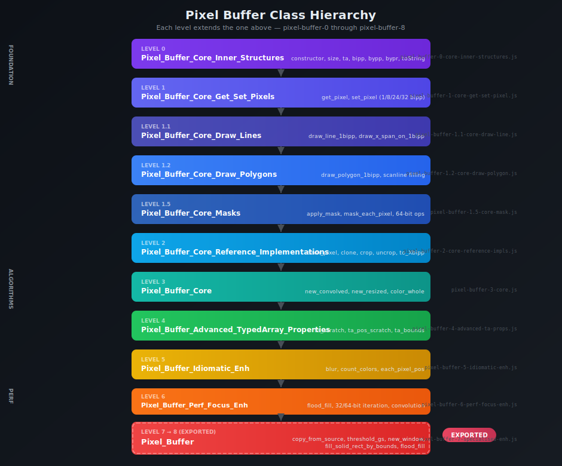
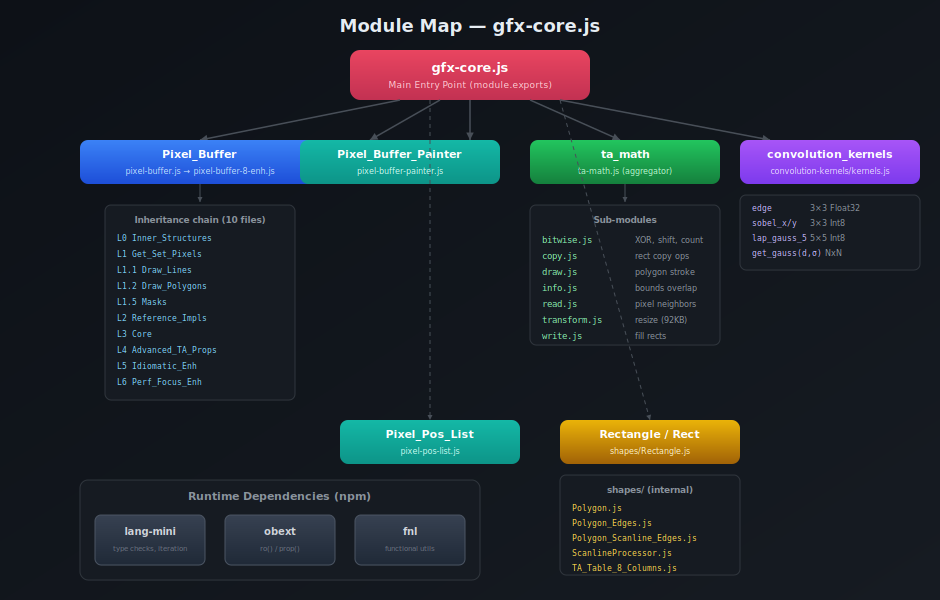

# Chapter 3: Architecture & Class Hierarchy

## Design Philosophy

jsgui3-gfx-core uses a **layered class hierarchy** where each layer adds a specific category of functionality. The pixel buffer starts as a simple data structure (typed array + dimensions) at the bottom, and gains increasingly sophisticated capabilities as you move up the chain.

This architecture serves two goals:
1. **Separation of concerns** — each file is focused on one aspect (get/set pixels, draw lines, masking, etc.)
2. **Incremental complexity** — lower layers can be understood and tested independently

## The Class Hierarchy



### Layer-by-Layer Breakdown

| Level | Class | File | Responsibility |
|-------|-------|------|---------------|
| 0 | `Pixel_Buffer_Core_Inner_Structures` | `pixel-buffer-0-core-inner-structures.js` | Memory allocation, size/bipp properties, typed array setup |
| 1 | `Pixel_Buffer_Core_Get_Set_Pixels` | `pixel-buffer-1-core-get-set-pixel.js` | `get_pixel`, `set_pixel` for all bit depths |
| 1.1 | `Pixel_Buffer_Core_Draw_Lines` | `pixel-buffer-1.1-core-draw-line.js` | Line rasterization (Bresenham-style), x-span drawing |
| 1.2 | `Pixel_Buffer_Core_Draw_Polygons` | `pixel-buffer-1.2-core-draw-polygon.js` | Polygon rasterization via scanline filling |
| 1.5 | `Pixel_Buffer_Core_Masks` | `pixel-buffer-1.5-core-mask.js` | 1bipp mask application, 64-bit aligned operations |
| 2 | `Pixel_Buffer_Core_Reference_Implementations` | `pixel-buffer-2-core-reference-implementations.js` | `each_pixel`, `clone`, `crop`, `uncrop`, format conversion (`to_8bipp`, `to_24bipp`, etc.) |
| 3 | `Pixel_Buffer_Core` | `pixel-buffer-3-core.js` | `new_convolved`, `new_resized`, `color_whole`, `color_rect` |
| 4 | `Pixel_Buffer_Advanced_TypedArray_Properties` | `pixel-buffer-4-advanced-typedarray-properties.js` | Scratch typed arrays, iterator positions, lazy property init |
| 5 | `Pixel_Buffer_Idiomatic_Enh` | `pixel-buffer-5-idiomatic-enh.js` | `blur`, `count_colors`, `each_pixel_pos`, idiomatic API |
| 6 | `Pixel_Buffer_Perf_Focus_Enh` | `pixel-buffer-6-perf-focus-enh.js` | Flood fill, 32/64-bit iteration, `apply_square_convolution`, color replacement |
| 7 | `Pixel_Buffer_Specialised_Enh` | `pixel-buffer-7-specialised-enh.js` | Windows, `copy_from_source`, `threshold_gs`, advanced rect operations |
| 8 | (Re-export) | `pixel-buffer-8-enh.js` | Re-exports level 7 as `Pixel_Buffer` |

The final `pixel-buffer.js` simply re-exports level 8, and this is what `gfx-core.js` exposes as `Pixel_Buffer`.

## Module Map



## The Export Surface: gfx-core.js

The main entry point (`core/gfx-core.js`) assembles the public API:

```js
const gfx_core = {
    Pixel_Pos_List:        require('./pixel-pos-list'),
    Pixel_Buffer:          require('./pixel-buffer'),        // → pixel-buffer-8 → 7
    Pixel_Buffer_Painter:  require('./pixel-buffer-painter'),
    convolution_kernels:   require('./convolution-kernels/kernels'),
    ta_math:               require('./ta-math'),
    Rectangle,             // from ./shapes/Rectangle
    Rect: Rectangle        // alias
};
module.exports = gfx_core;
```

### What's Exported vs Internal

| Exported | Description |
|----------|-------------|
| `Pixel_Buffer` | The full-featured pixel buffer class (all 10 layers) |
| `Pixel_Buffer_Painter` | Fluent drawing API for rectangles |
| `Pixel_Pos_List` | Sparse pixel coordinate storage |
| `convolution_kernels` | Predefined kernel arrays (edge, blur, Sobel, etc.) |
| `ta_math` | TypedArray math operations (bitwise, copy, draw, etc.) |
| `Rectangle` / `Rect` | Rectangle geometry class |

| Internal (not directly exported) | Used by |
|----------------------------------|---------|
| `Convolution` / `Float32Convolution` | Pixel buffer's `new_convolved` method |
| `Polygon`, `Polygon_Edges`, `Polygon_Scanline_Edges` | Polygon drawing methods |
| `ScanlineProcessor` | Polygon rasterization |
| `TA_Table_8_Columns` | Polygon edge tracking |
| `Virtual_Float_Pixel` | Resize algorithm (area-weighted sampling) |
| `Typed_Array_Binary_Read_Write` | Binary bit access utilities |

## Dependencies

All three runtime dependencies are small utility libraries:

### lang-mini
Provides `each`, `fp`, `tof` (type of), `tf` (type flag), `get_a_sig` (argument signature analysis), and `are_equal`. Used throughout for type checking and iteration.

### obext
Provides two key helpers:
- **`ro(obj, name, getter)`** — Define a read-only property with a getter
- **`prop(obj, name, getter, setter)`** — Define a managed property with get/set

These are used extensively in the constructor of `Pixel_Buffer_Core_Inner_Structures` to define properties like `size`, `bipp`, `ta`, etc.

### fnl
Functional utilities. Used indirectly. The dev dependency `fnlfs` adds file I/O for examples.

## The ta_math Subsystem

The `ta_math` module is itself a collection of sub-modules providing low-level typed array operations:

```
ta-math.js              ← aggregator
├── bitwise.js          ← bit shifts, XOR, count 1s, find set bits
├── copy.js             ← rect-to-rect copying at various bipp
├── draw.js             ← polygon outline rasterization to typed arrays
├── info.js             ← bounds overlap detection
├── read.js             ← read pixel neighborhoods (1×2, 2×1, 2×2)
├── transform.js        ← resize (area-weighted), color transforms (92KB!)
├── write.js            ← fill solid rectangles
└── x_spans.js          ← x-span data structure stubs
```

These functions operate directly on `Uint8Array` / `BigUint64Array` data without needing a Pixel Buffer object, making them useful as standalone utilities for performance-critical code.

## The Shapes Subsystem

```
shapes/
├── Shape.js                    ← Base class (empty)
├── Rectangle.js                ← Rectangle with extend, overlap, intersect
├── Polygon.js                  ← Polygon with points, bounds, edge tracking
├── Polygon_Edges.js            ← Edge pairs for scanline processing
├── Polygon_Scanline_Edges.js   ← Active edge list during scanline fill
├── ScanlineProcessor.js        ← Drives the scanline fill algorithm
├── TA_Table_8_Columns.js       ← 8-column typed array table for edge data
└── is_debug.js                 ← Debug flag
```

These classes work together to perform **scanline polygon rasterization** — the process of converting polygon vertex coordinates into filled pixel regions on a pixel buffer.

---

**← [Chapter 2: Installation](./02-installation.md)** | **[Chapter 4: Pixel Buffer API Reference →](./04-pixel-buffer-api.md)**
