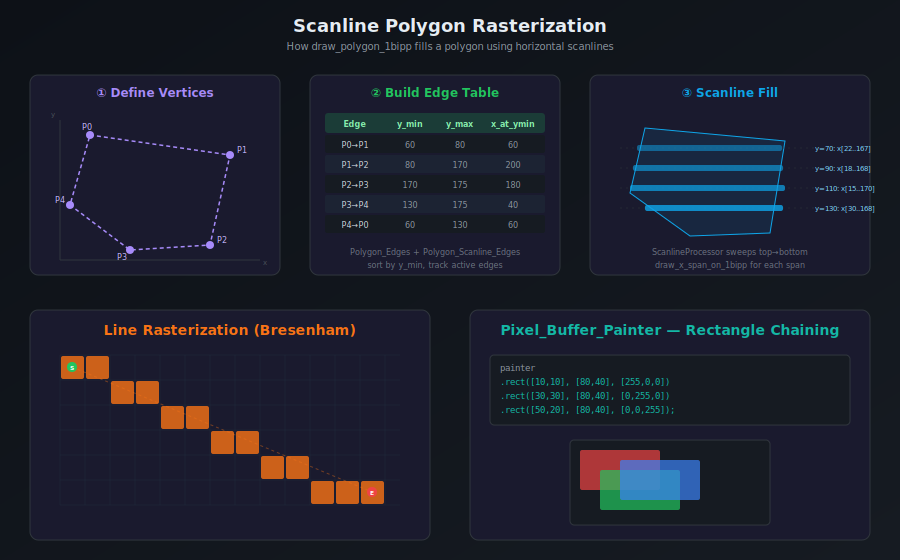

# Chapter 5: Drawing — Lines, Polygons, Rectangles

This chapter covers all the drawing primitives available in jsgui3-gfx-core. All drawing operates directly on the pixel buffer's typed array — there is no separate rendering pipeline.



## Drawing Lines (Level 1.1)

### `draw_line_1bipp(ta_pixel_pair, color)`

Rasterizes a line between two points on a 1bipp pixel buffer using a Bresenham-style algorithm.

```js
const pb = new Pixel_Buffer({ bits_per_pixel: 1, size: [256, 256] });

// Define endpoints as Int16Array: [x1, y1, x2, y2]
const endpoints = new Int16Array([10, 20, 200, 150]);
pb.draw_line_1bipp(endpoints, 1);  // color=1 means "bit on"
```

**How it works internally:**

1. Calculates the absolute differences in x and y (`dx`, `dy`)
2. Determines the major axis (which has the greater delta)
3. Steps along the major axis one pixel at a time
4. Accumulates error to determine when to step on the minor axis
5. Sets each pixel using `set_pixel_on_1bipp_xy(x, y)`

### `draw_x_span_on_1bipp(x, y, length)`

Draws a horizontal span of bits. This is the inner primitive used by scanline polygon filling:

```js
pb.draw_x_span_on_1bipp(10, 50, 200);  // 200 pixels wide at y=50
```

This function is optimized to handle:
- **Partial bytes** at the start and end of the span (using bit masking)
- **Full bytes** in the middle (using `0xFF` bulk fill)
- Spans that fit within a single byte

## Drawing Polygons (Level 1.2)

Polygons are rasterized using a **scanline fill algorithm**. The process is:

1. **Build an edge table** from the polygon's vertices
2. **Sweep scanlines** from top to bottom
3. At each scanline, find where it **intersects** the polygon edges
4. **Fill the x-spans** between pairs of intersections

### Using with the `Polygon` Class

```js
const Polygon = require('jsgui3-gfx-core/core/shapes/Polygon');

const polygon = new Polygon([
    [50, 20],
    [150, 30],
    [180, 120],
    [100, 150],
    [30, 100]
]);

const pb = new Pixel_Buffer({ bits_per_pixel: 1, size: [200, 200] });

// Draw with stroke only
pb.draw_polygon_1bipp(polygon, 1);

// Draw with stroke and fill
pb.draw_polygon_1bipp(polygon, 1, 1);  // stroke_color=1, fill_color=1
```

### `draw_polygon_1bipp(polygon, stroke_color, fill_color)`

The main polygon drawing method. When `fill_color` is provided:
1. The polygon outline is rasterized using `draw_polygon_outline_to_ta_1bipp()` from `ta_math`
2. The `ScanlineProcessor` scans the polygon, computing x-spans per row
3. Each span is filled using `draw_x_span_on_1bipp()`

### `draw_filled_polygon_to_1bipp_pixel_buffer_mask(points)` — Level 6

For drawing filled polygons as masks (used in compositing):

```js
const points = [[10,10], [100,20], [90,80], [5,70]];
pb.draw_filled_polygon_to_1bipp_pixel_buffer_mask(points);
```

### Scanline Fill Internals

The scanline fill uses several helper classes:

| Class | File | Role |
|-------|------|------|
| `Polygon` | `shapes/Polygon.js` | Stores vertices, calculates bounds |
| `Polygon_Edges` | `shapes/Polygon_Edges.js` | Edge pair storage and sorting |
| `Polygon_Scanline_Edges` | `shapes/Polygon_Scanline_Edges.js` | Active edge tracking |
| `ScanlineProcessor` | `shapes/ScanlineProcessor.js` | Drives the scanline sweep |
| `TA_Table_8_Columns` | `shapes/TA_Table_8_Columns.js` | Typed array table for edge data |

## Drawing Rectangles

### `draw_rect(pos_corner, pos_other_corner, color)` — Level 2

Draws a rectangle outline (not filled):

```js
pb.draw_rect([10, 10], [100, 80], [255, 0, 0]);
```

### `color_rect(bounds, color)` — Level 3

Fills a rectangular region with a solid color:

```js
const bounds = new Int16Array([20, 20, 120, 100]);  // [x1, y1, x2, y2]
pb.color_rect(bounds, [0, 128, 255]);
```

### `Pixel_Buffer_Painter` — Fluent Rectangle API

The `Pixel_Buffer_Painter` wraps the lower-level `fill_solid_rect_by_bounds` from `ta_math`:

```js
const { Pixel_Buffer, Pixel_Buffer_Painter } = require('jsgui3-gfx-core');

const pb = new Pixel_Buffer({ bits_per_pixel: 24, size: [200, 200] });
const painter = new Pixel_Buffer_Painter({ pb });

// Method chaining — each .rect() returns the painter
painter
    .rect([10, 10], [80, 40], [255, 0, 0])     // position, size, color
    .rect([30, 30], [80, 40], [0, 255, 0])
    .rect([50, 20], [80, 40], [0, 0, 255]);
```

**Parameters:**
- `pos` — `[x, y]` top-left corner
- `size` — `[width, height]`
- `color` — Color value matching the pixel buffer's `bipp`

Internally, the painter converts position + size to bounds, then calls:
```js
fill_solid_rect_by_bounds(pb.ta, pb.bypr, ta_bounds, pb.bipp, color);
```

### `paint_solid_border(width, color)` — Level 2

Paints a solid border around the entire buffer:

```js
pb.paint_solid_border(3, [255, 255, 255]);  // 3px white border
```

## Masking & Compositing (Level 1.5)

1bipp pixel buffers serve as **masks** for compositing operations:

```js
// Create a 1bipp mask
const mask = new Pixel_Buffer({ bits_per_pixel: 1, size: [200, 200] });

// Draw a polygon mask
const polygon = new Polygon([[50,20], [150,30], [180,120], [30,100]]);
mask.draw_polygon_1bipp(polygon, 1, 1);

// Apply mask to a 24bipp or 32bipp buffer
rgb_pb.apply_mask(mask, 255, 0, 0, 255);  // Red where mask is 1
```

### `draw_1bipp_pixel_buffer_mask(mask_pb, color)` — Level 2

Draws color onto this buffer where the mask has bits set:

```js
rgb_pb.draw_1bipp_pixel_buffer_mask(mask, [255, 0, 0]);
```

### `mask_each_pixel(callback)` — Level 1.5

Iterates mask pixels:

```js
mask.mask_each_pixel((x, y, is_on) => {
    if (is_on) {
        target.set_pixel([x, y], [255, 0, 0]);
    }
});
```

## Using Pixel_Pos_List for Drawing

`Pixel_Pos_List` stores sparse pixel positions and can paint them onto a buffer:

```js
const { Pixel_Pos_List, Pixel_Buffer } = require('jsgui3-gfx-core');

const list = new Pixel_Pos_List();
list.add([10, 20]);
list.add([15, 25]);
list.add([20, 30]);

const pb = new Pixel_Buffer({ bits_per_pixel: 24, size: [100, 100] });
pb.paint_pixel_list(list, [255, 255, 0]);  // Yellow dots
```

---

**← [Chapter 4: Pixel Buffer API](./04-pixel-buffer-api.md)** | **[Chapter 6: Convolution & Image Processing →](./06-convolution.md)**
